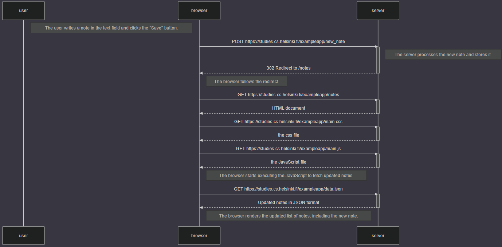

sequenceDiagram
    participant user
    participant browser
    participant server

    Note right of user: The user writes a note in the text field and clicks the "Save" button.

    browser->>server: POST https://studies.cs.helsinki.fi/exampleapp/new_note
    activate server
    Note right of server: The server processes the new note and stores it.
    server-->>browser: 302 Redirect to /notes
    deactivate server

    Note right of browser: The browser follows the redirect.

    browser->>server: GET https://studies.cs.helsinki.fi/exampleapp/notes
    activate server
    server-->>browser: HTML document
    deactivate server

    browser->>server: GET https://studies.cs.helsinki.fi/exampleapp/main.css
    activate server
    server-->>browser: the css file
    deactivate server

    browser->>server: GET https://studies.cs.helsinki.fi/exampleapp/main.js
    activate server
    server-->>browser: the JavaScript file
    deactivate server

    Note right of browser: The browser starts executing the JavaScript to fetch updated notes.

    browser->>server: GET https://studies.cs.helsinki.fi/exampleapp/data.json
    activate server
    server-->>browser: Updated notes in JSON format
    deactivate server

    Note right of browser: The browser renders the updated list of notes, including the new note.

[0.4 Note Diagram](part0-4-notediagram.png)