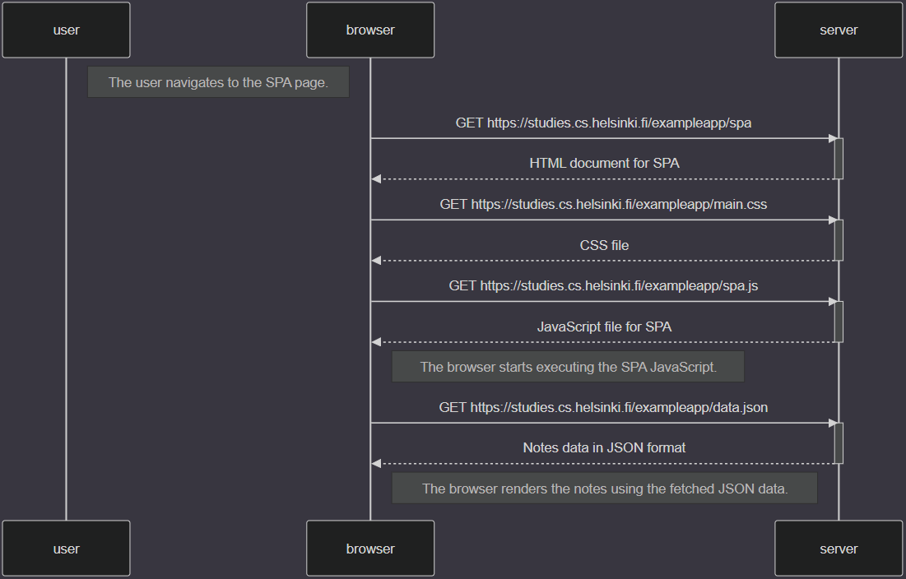

sequenceDiagram
    participant user
    participant browser
    participant server

    Note right of user: The user navigates to the SPA page.

    browser->>server: GET https://studies.cs.helsinki.fi/exampleapp/spa
    activate server
    server-->>browser: HTML document for SPA
    deactivate server

    browser->>server: GET https://studies.cs.helsinki.fi/exampleapp/main.css
    activate server
    server-->>browser: CSS file
    deactivate server

    browser->>server: GET https://studies.cs.helsinki.fi/exampleapp/spa.js
    activate server
    server-->>browser: JavaScript file for SPA
    deactivate server

    Note right of browser: The browser starts executing the SPA JavaScript.

    browser->>server: GET https://studies.cs.helsinki.fi/exampleapp/data.json
    activate server
    server-->>browser: Notes data in JSON format
    deactivate server

    Note right of browser: The browser renders the notes using the fetched JSON data.

[0.5 Single Page App](part0-5-singlepageapp.png)