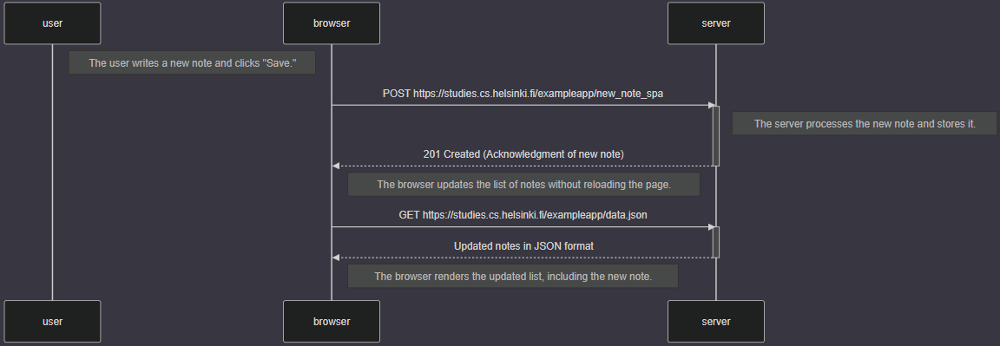

sequenceDiagram
    participant user
    participant browser
    participant server

    Note right of user: The user writes a new note and clicks "Save."

    browser->>server: POST https://studies.cs.helsinki.fi/exampleapp/new_note_spa
    activate server
    Note right of server: The server processes the new note and stores it.
    server-->>browser: 201 Created (Acknowledgment of new note)
    deactivate server

    Note right of browser: The browser updates the list of notes without reloading the page.

    browser->>server: GET https://studies.cs.helsinki.fi/exampleapp/data.json
    activate server
    server-->>browser: Updated notes in JSON format
    deactivate server

    Note right of browser: The browser renders the updated list, including the new note.

[0.6 New note in a Single Page](part0-6-newnotesinglepage.png)